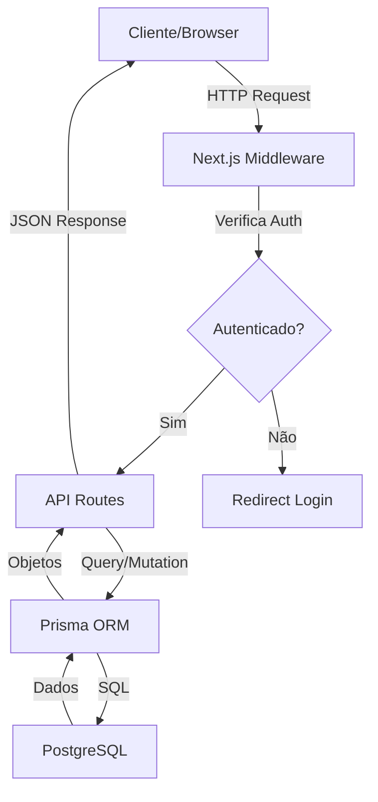

# 🏗️ Arquitetura - AgendaTech Escolar

## 📁 Estrutura do Projeto

```
agenda-tech/
├── app/                    # App Router do Next.js 15
│   ├── api/               # API Routes
│   │   ├── auth/         # Endpoints de autenticação
│   │   ├── bookings/     # Endpoints de agendamentos
│   │   ├── resources/    # Endpoints de recursos
│   │   └── time-blocks/  # Endpoints de blocos de horário
│   ├── dashboard/         # Páginas do dashboard (protegidas)
│   ├── login/            # Página de login
│   ├── register/         # Página de cadastro
│   └── page.tsx          # Landing page
├── components/            # Componentes React reutilizáveis
│   ├── ui/              # Componentes UI base (Radix UI)
│   └── ...              # Componentes específicos do app
├── contexts/             # Context API providers
├── hooks/                # Custom React hooks
├── lib/                  # Utilitários e configurações
├── prisma/               # Schema e migrações do banco
├── public/               # Assets estáticos
└── docs/                 # Documentação do projeto
```

## 🔄 Fluxo de Dados



## 🗄️ Modelo de Dados

### User

- Armazena informações dos usuários
- Roles: diretor, coordenador, professor, funcionario

### Resource

- Equipamentos (datashow, tv, chromebook)
- Espaços (lab, biblioteca)
- Status: available, maintenance, blocked

### TimeBlock

- Define os horários disponíveis
- Turnos: morning, afternoon, night

### Booking

- Relaciona User + Resource + TimeBlock + Date
- Status: pending, confirmed, completed, cancelled

### MaintenanceBlock

- Bloqueia recursos para manutenção

## 🔐 Autenticação

- **JWT** armazenado em cookie httpOnly
- Middleware verifica token em rotas protegidas
- Contexto global mantém estado do usuário

## 🎨 UI/UX

- **Design System**: Radix UI + Tailwind CSS
- **Componentes**: Shadcn/ui customizados
- **Responsivo**: Mobile-first approach
- **Acessibilidade**: WCAG 2.1 AA compliance

## ⚡ Performance

- **SSR**: Server-side rendering para SEO
- **Code Splitting**: Automático pelo Next.js
- **Image Optimization**: Next/Image
- **Caching**: Headers apropriados nas APIs

## 🚀 Deploy

### Recomendado: Vercel

1. Push para GitHub
2. Import no Vercel
3. Configurar variáveis de ambiente
4. Deploy automático

### Alternativas

- Railway (com PostgreSQL incluído)
- Render
- DigitalOcean App Platform
